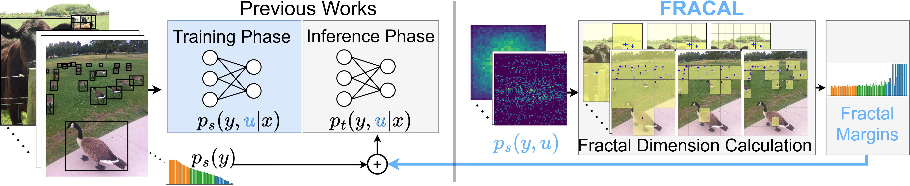

<h1>[CVPR2025] Fractal Calibration for long-tailed object detection </h1>
Real-world datasets follow an imbalanced distribution, which poses significant challenges in rare-category object detection. Recent studies tackle this problem by developing re-weighting and re-sampling methods, that utilise the class frequencies of the dataset. However, these techniques focus solely on the frequency statistics and ignore the distribution of the classes in image space, missing important information.
In contrast to them, we propose <b>FRA</b>ctal <b>CAL</b>ibration (FRACAL): a novel post-calibration method for long-tailed object detection. FRACAL devises a logit adjustment method that utilises the fractal dimension to estimate how uniformly classes are distributed in image space. During inference, it uses the fractal dimension to inversely downweight the probabilities of uniformly spaced class predictions achieving balance in two axes: between frequent and rare categories, and between uniformly spaced and sparsely spaced classes. FRACAL is a post-processing method and it does not require any training, also it can be combined with many off-the-shelf models such as one-stage sigmoid detectors and two-stage instance segmentation models. FRACAL boosts the rare class performance by up to 8.6% and surpasses all previous methods on LVIS dataset, while showing good generalisation to other datasets such as COCO, V3Det and OpenImages.

 
### Progress

- [x] Training code.
- [x] Evaluation code.
- [ ] Provide instance segmentation checkpoint models.

<h1> Getting Started </h1>
Create a virtual environment

```
conda create --name fracal python=3.11 -y
conda activate fracal
```

1. Install dependency packages
```
conda install pytorch torchvision -c pytorch
```

2. Install MMDetection
```
pip install -U openmim
mim install mmengine
mim install "mmcv==2.1.0"
git clone https://github.com/kostas1515/FRACAL.git
```

3. Create data directory, download COCO 2017 datasets at https://cocodataset.org/#download (2017 Train images [118K/18GB], 2017 Val images [5K/1GB], 2017 Train/Val annotations [241MB]) and extract the zip files:

```
mkdir data
cd data
wget http://images.cocodataset.org/zips/train2017.zip
wget http://images.cocodataset.org/zips/val2017.zip

#download and unzip LVIS annotations
wget https://s3-us-west-2.amazonaws.com/dl.fbaipublicfiles.com/LVIS/lvis_v1_train.json.zip
wget https://s3-us-west-2.amazonaws.com/dl.fbaipublicfiles.com/LVIS/lvis_v1_val.json.zip

```

4. modify mmdetection/configs/_base_/datasets/lvis_v1_instance.py and make sure data_root variable points to the above data directory, e.g.,
```data_root = '<user_path>'```

<h1>Training </h1>
Train a baseline model on multiple GPUs using <i>tools/dist_train.sh</i> e.g.:

```
./tools/dist_train.sh ./configs/<folder>/<model.py> <#GPUs>
```

<h1>Inference with Baseline Model</h1>

To test the baseline model run:
```
./tools/dist_test.sh ./experiments/<output_folder>/<model.py> ./experiments/<output_folder>/latest.pth <#GPUs> --eval bbox segm
```

E.g: To test the MaskRCNN ResNet50 RFS with Normalised Mask and Carafe on 4 GPUs run:
```
./tools/dist_test.sh ./experiments/r50_rfs_cos_lr_norm_carafe_4x4_2x_softmax/r50_rfs_cos_lr_norm_carafe_4x4_2x_softmax.py ./experiments/r50_rfs_cos_lr_norm_carafe_4x4_2x_softmax/latest.pth 4 --eval bbox segm
```
     
<h1>Inference with FRACAL</h1>
     
To infer with FRACAL run:
```
./tools/dist_test.sh ./configs/<folder>/local/<model.py> ./experiments/<output_folder>/latest.pth <#GPUs> --eval bbox segm
```

E.g: To test the FRACAL-MaskRCNN ResNet50 RFS with Normalised Mask and Carafe on 4 GPUs run:
```
./tools/dist_test.sh ./experiments/r50_rfs_cos_lr_norm_4x4_2x_softmax_carafe/r50_rfs_cos_lr_norm_4x4_2x_softmax_carafe.py ./experiments/r50_rfs_cos_lr_norm_4x4_2x_softmax_carafe/epoch_24.pth 8
```

<h1>Optional - Get Dataset statistics </h1>
We already provide the frequency and fractal dimension measures for LVIS_v1 train set, in the folder stat_files. 
If one needs to reproduce them then to generate the fractal dimension measures:

1. run the get_statistics.py inside the folder ./stat_files/:

```
python get_statistics.py --dset_name lvis --path ../../../datasets/coco/annotations/lvis_v1_train.json  --output ./lvis_v1_train_stats.csv
```

This will create a csv containing various bounding box statistics such the class, width, height, location etc...

2. compute the fractal dimension based on those statistics:
```
python calculate_fractality.py --dset_name lvisv1 --path ./lvis_v1_train_stats.csv --output lvis_v1_train_fractal_dim.csv
```

To generate the frequency weights run:
```
python get_frequency.py --path ../../../datasets/coco/annotations/lvis_v1_train.json --output idf_lvis_v1_train.csv
```

This will create a csv containing various frequency weights based on instance frequency or image frequency using various link functions. The ```lvis_v1_train_fractal_dim.csv``` and ```idf_lvis_v1_train.csv``` are used inside the ```\mmdet\models\roi_heads\bbox_heads\fracal_bbox_head.py``` script.

The statistical calculations scripts support COCO,LVISv1,LVISv05,V3Det,OpenImages datasets.